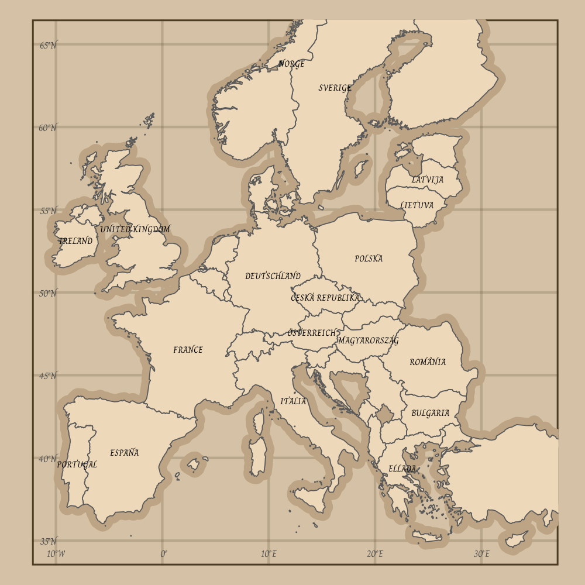
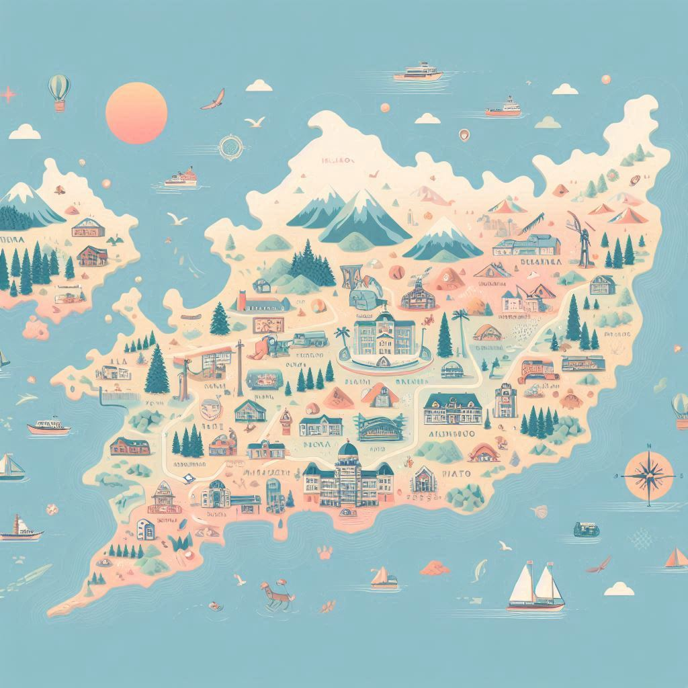

# #30DayMapChallenge 2024

## 1. Points

## 2. Lines

## 3. Polygons

## 4. Hexagons

## 5. A Journey

## 6. Raster

## 7. Vintage Style

## 8. Humanitarian Data Exchange

## 9. AI Only

## 10. Pen and Paper

## 11. Arctic

## 12. Time and Space

## 13. A New Tool

## 14. A World Map

## 15. My Data

## 16. Choropleth

## 17. Collaborative map

## 18. 3D

## 19. Typography

## 20. OpenStreetMap

## 21. Conflict

## 22. 2 Colours

## 23. Memory

## 24. Only circular shapes

## 25. Heat

## 26. Map projections

## 27. Micromapping

## 28. The blue planet

